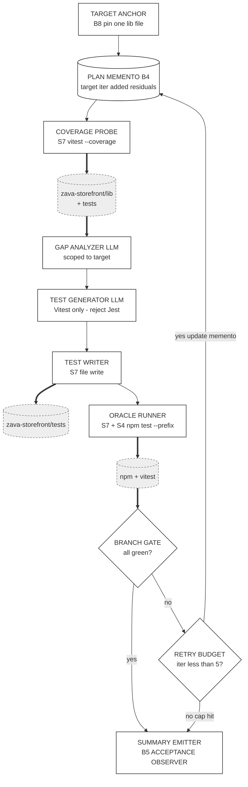

# Track 1 · `test-improver`

> **You are not fixing the app. You are authoring a Skill** that finds untested branches in `zava-storefront/lib/cart.ts` (and friends), proposes the missing tests, runs `npm test`, and iterates until green.

⏱️ **90 min**

---

## 📚 Theory anchor

- **Live:** [Architectural Patterns Rosetta Stone — *Verification Loops*](https://danielmeppiel.github.io/agentic-sdlc-handbook/handbook/ch18-architectural-patterns-rosetta-stone.html)
- **Live:** [The PROSE Specification](https://danielmeppiel.github.io/agentic-sdlc-handbook/handbook/ch12-the-prose-specification.html)

**Local fallback (3 sentences):** A Skill is a *narrowly-scoped procedure* an agent invokes — not a generalist prompt. The PROSE constraint *Reduced Scope* tells us the test-improver should refuse anything other than "fill missing test coverage in this file"; *Safety Boundaries* keep it from editing source under test. The verification loop pattern (write → run → read failure → refine) is what turns "Copilot drafted some tests" into "the test suite actually passes."

---

## 🔍 Discover the problem

Open these three files:

- [`zava-storefront/lib/cart.ts`](https://github.com/DevExpGbb/zava-storefront/blob/workshop-v1/lib/cart.ts) · `addItem`, `applyDiscount`, `computeTax`, `totalize`
- [`zava-storefront/lib/orders.ts`](https://github.com/DevExpGbb/zava-storefront/blob/workshop-v1/lib/orders.ts) · `createOrder`, `findOrder`, `fulfillmentMessage`
- [`zava-storefront/tests/cart.test.ts`](https://github.com/DevExpGbb/zava-storefront/blob/workshop-v1/tests/cart.test.ts) · note the comment block at the bottom listing **uncovered branches**

Now ask your AI chat assistant (no Skill, no extra context) the naïve prompt:

> "Add tests for `lib/cart.ts`."

Observe:

- It might use Jest syntax — but this app uses **Vitest**.
- It probably misses `applyDiscount` edge cases (`VIP25` threshold, unknown codes).
- Run it twice. Different drafts each time.

That drift is what a Skill removes.

---

## 🧠 Design with Genesis (5 min)

[`genesis`](https://github.com/DevExpGbb/genesis) is pinned in `apm.yml` as a design assistant. Invoke it before writing any `SKILL.md`.

In your IDE (your agent harness — Copilot CLI, Claude Code, Codex, Cursor, OpenCode all work), summon Genesis. **Verify it's loaded first** — type `/genesis` and confirm autocomplete or an acknowledgment from the persona. If nothing happens, run `apm install` again and check `.agents/skills/genesis/` exists.

```
/genesis I want a test-improver skill. It must:
- Target a single source file under zava-storefront/lib/
- Detect functions whose branches/error paths are uncovered by zava-storefront/tests/
- Generate vitest tests for the missing branches (NOT Jest)
- Run `npm test --prefix zava-storefront` after each iteration
- Stop when all branches are green or after 5 iterations
- Emit one final summary comment listing what it added

Draw an ASCII art diagram of the proposed skill architecture and explain the reasons of the design.
```

Genesis returns an ASCII diagram + a design rationale. **Read both before coding.** That output *is* your spec — don't ask your harness to generate the skill until you've read what Genesis chose and why.

### What Genesis returned for this brief

The diagram below is rendered in Mermaid for GitHub readability — but Genesis emits ASCII into your chat. Same components, same edges. Yours may differ in naming / node count; what matters is whether the **architectural choices** below show up.



**Why this shape (rationale Genesis explained):**

- **A9 SUPERVISED EXECUTION** with a bounded retry arm — chosen over A8 ALIGNMENT LOOP because convergence ("all branches in target file covered") is a **deterministic tool fact**, not goal alignment. The oracle is `npm test`, not the LLM.
- **B4 PLAN MEMENTO** — target file, iteration counter, and added-tests ledger persist across rounds, reloaded each iteration. Without it, the loop drifts on its own short memory.
- **B8 ATTENTION ANCHOR** — scope is locked to one `lib/` file. Long-context drift cannot widen the blast radius mid-loop.
- **S7 DETERMINISTIC TOOL BRIDGE** wraps every consequential step — coverage probe, file write, `npm test`. The LLM never re-derives coverage from recall.
- **Hard 5-iteration cap** — guards against UNBOUNDED LOOP. Cap-hit is treated as a real outcome (summary still emits), not silent failure.
- **Out of scope (deliberate):** editing `lib/` source, multi-file targets, fixing pre-existing failing prod tests.

> 💾 **Persist Genesis's output.** Don't lose it to chat scrollback. Save it (the ASCII + rationale) to `.apm/skills/test-improver/DESIGN.md` (after step 2 below creates the folder) so future redesigns start from a real artifact.

---

## 🛠️ Build (15 min) — *let Genesis implement what Genesis designed*

In the same chat where Genesis just emitted the design, prompt your harness:

> Now use the genesis skill to implement the skill per our agreed design.

That's it. Genesis takes over: it applies its own step-7b discipline (probe runtime, draft SKILL.md, validate against the design). Any installed instructions — like `prose-style.md` from `code-kit` — get loaded by the harness automatically; you don't need to remind Genesis what frontmatter shape to use.

Review the output node-for-node against the design diagram.

### Iterate naturally

The high-leverage moves aren't tweaks to the *original* prompt — they're new asks that build on what Genesis just shipped. Each one shows Genesis applying its own discipline to a real evolutionary need:

- **Add evals.** *"Use the genesis skill to add evals for this skill."* Genesis proposes the eval harness — fixtures, expected outcomes, the regression contract that lets you refactor the prompt later without fear.
- **Make it run in CI/CD.** *"Use the genesis skill to make this run in CI/CD."* Genesis proposes a [`gh-aw`](https://githubnext.com/projects/agentic-workflows/) agentic workflow — trigger label, paths filter, the same skill that runs in your IDE now running on PRs.
- **Modularize the specialist personas.** *"Use the genesis skill to modularize the specialist personas as a separate apm package."* Genesis proposes a package split — pulls the reusable personas into their own pinnable APM package.

That's the loop you'll keep using long after the workshop: the skill grows by composition, not by hand-edits.

📁 Stuck? Peek at [`docs/golden-examples/test-improver.SKILL.md`](../golden-examples/test-improver.SKILL.md) — but only after Genesis has produced its first draft.

---

## ✅ Validate locally (5 min)

In your IDE, drive the skill:

> "Use the test-improver skill on `zava-storefront/lib/cart.ts`."

Watch the agent:

1. Read `cart.ts`.
2. Compare against `tests/cart.test.ts`.
3. Generate new vitest cases (e.g. for `VIP25`, `WELCOME10`, `computeTax` regions).
4. Run `npm test --prefix zava-storefront`.
5. Iterate.

When the loop converges, run it yourself:

```bash
npm test --prefix zava-storefront
```

You should see new tests covering the cases listed in `cart.test.ts`'s comment block.

---

## 📦 Package locally (5 min) — *see what `apm pack` actually ships*

Before you automate anything, run the pack command yourself and look at the artifact:

```bash
apm pack --archive
ls build/
# → build/test-improver-0.1.0.tar.gz

tar tzf build/test-improver-0.1.0.tar.gz
```

You'll see the bundle contains:

- `plugin.json` — synthesized from your `apm.yml` (run `apm init --plugin` if you want to commit one explicitly)
- `apm.lock.yaml` — dependency pin manifest
- `skills/test-improver/SKILL.md` — what consumers actually load
- `skills/test-improver/references/`, `evals/` — anything else under your skill folder

That tarball is your skill bundle. Hand it to a teammate, they `apm install` it, and your skill is live in their harness. **No magic** — a manifest and a directory tree.

## 🚀 Automate the release (5 min)

Now that you've seen the local flow, automate it. The release workflow runs the same `apm pack` on every tagged push:

```bash
git add . && git commit -m "feat: test-improver skill v0.1.0"

# If you ran multiple tracks in the same repo, scope the tag:
git tag v0.1.0-test-improver   # or just v0.1.0 if this is your only track
git push origin main --tags
```

> 💡 **Tag collision warning.** Every track guide says `git tag v0.1.0`. If you re-run or run multiple tracks in the same repo, scope per-track (`v0.1.0-test-improver`) or delete the old tag first (`git tag -d v0.1.0 && git push --delete origin v0.1.0`).

The release workflow (`.github/workflows/release.yml`) validates → packs → publishes a GitHub Release with the tarball attached.

---

## 🌐 Automate (15 min)

Workshop scaffold (do these in order — silent failures otherwise):

```bash
# 1 · Create the trigger label first. Without it, the workflow's `on: labeled`
#     stanza never fires and you'll think your Skill is broken.
gh label create run-test-improver --color B0E0FF --description "Run the test-improver skill on this PR"

# 2 · Edit .github/workflows/my-workflow.md. Concrete diff against the scaffold:
#
#       on:
#         pull_request:
#     -     types: [labeled]
#     +     types: [labeled]
#     +     paths: ['zava-storefront/lib/**']
#         workflow_dispatch:
#         roles: [admin, maintainer, write]
#
#       if: |
#     -   (github.event_name == 'pull_request' && github.event.label.name == 'run-my-skill')
#     +   (github.event_name == 'pull_request' && github.event.label.name == 'run-test-improver')
#         || github.event_name == 'workflow_dispatch'

# 3 · Compile (gh aw produces a real .lock.yml from the .md you edited):
gh aw compile      # → .github/workflows/my-workflow.lock.yml  (see https://github.github.com/gh-aw/reference/faq/#what-is-a-workflow-lock-file for why both files exist)
git add .github/workflows/ && git commit -m "ci: compile test-improver workflow"
git push
```

Open a PR touching `zava-storefront/lib/cart.ts`, label it `run-test-improver`, and watch your skill execute on the PR — that's the inner→outer loop transition.

---

## 🌍 Platform payoff (your Skill in someone else's repo)

After §6 of the README, your team-mate can pin your tarball in *their* repo:

```yaml
# their apm.yml
dependencies:
  apm:
    - <your-org>/<your-repo>#v0.1.0-test-improver
```

`apm install` in their repo gets them the same `SKILL.md`, the same `allowed-tools` boundary, the same workflow scaffold. Versioned, reviewable, composable — **that's the package-manager-for-skills claim**.

---

## 🎓 What you learned

- **Genesis = design before code.** You wrote a spec (with an ASCII architecture diagram), then implemented to it.
- **Reduced Scope is real.** Your Skill targets *one file pattern*, not "test the codebase."
- **Local-first, CI second.** Same Skill, same agent, same outcome — whether you run it in your IDE or as a `gh aw` job.
