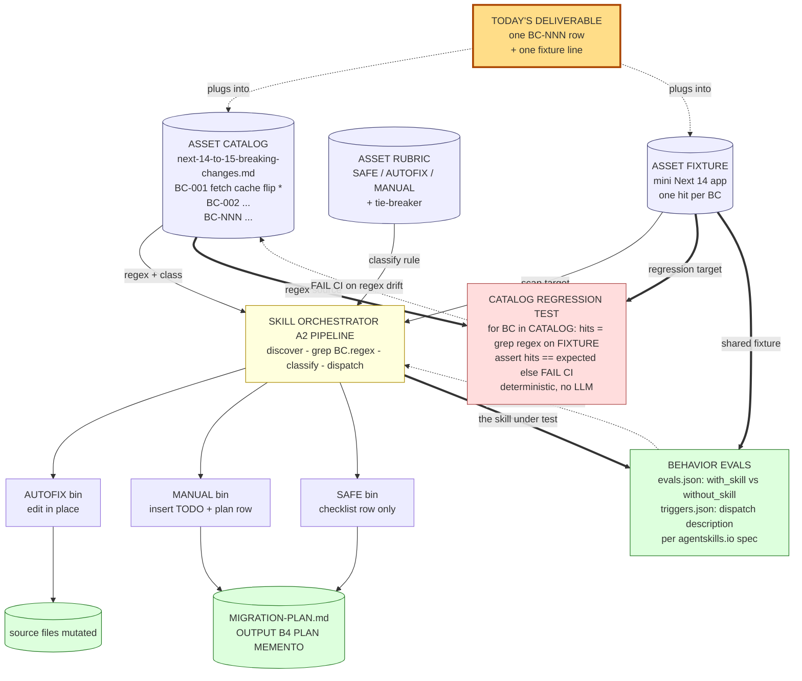

# Track 4 · `framework-modernizer` — Reference deep-dive (appendix)

> **You are not building a Skill in this track. You are *reading* one** — and authoring exactly one new catalog entry for *your* framework migration. The full fork (catalog + rubric + fixture + two test layers for a fresh framework pair) is a multi-hour exercise; we keep the workshop-time deliverable honest.

⏱️ **30 min** (not 45 — see budget below)

> 📦 **Deliverable check:** Tracks 1–3 ship a tagged `v0.1.0` skill on your repo. **Track 4 does not.** This track teaches the *pattern* so you can ship a real fork at home.

---

## 📚 Theory anchor

- **Live:** [Architectural Patterns Rosetta Stone — *Pipeline / Catalog patterns*](https://danielmeppiel.github.io/agentic-sdlc-handbook/handbook/ch18-architectural-patterns-rosetta-stone.html)
- **Live:** [The Reference Architecture](https://danielmeppiel.github.io/agentic-sdlc-handbook/handbook/ch04-the-reference-architecture.html)

**Local fallback (3 sentences):** Major framework upgrades are 80% mechanical (catalog the breaking changes, find them, autofix the trivial ones) and 20% judgment. LLMs hallucinate "breaking changes" from training data — the fix is not a smarter model but **a source-of-truth catalog with citations + a regression test that proves the regexes still match + behavior evals that prove the skill outperforms `without_skill`**. The Catalog → Rubric → Skill → (regression + behavior evals) shape generalizes: pick *any* X→Y framework pair and the same artifacts ship a defensible modernizer.

---

## 🔍 Why this track is different

We built [`framework-modernizer`](../../.apm/skills/framework-modernizer/) as the worked example. You'll **read** it, **run its tests** (catalog regression + behavior evals), and **author one new BC-NNN catalog entry** for your own framework pair — proving you understand the shape without pretending you can ship a fork in 30 min.

There is no `/genesis` step at the start of this track — the design is already on disk under `references/DESIGN.md`. You'll rerun `/genesis` *only* when you fork at home.

> 📦 **Productization heads-up.** The modernizer pattern you're reading here has graduated to a productized accelerator in [`DevExpGbb/zava-agent-config`](https://github.com/DevExpGbb/zava-agent-config) under `plugins/accelerators/modernize-kit/` (v6.1.0+), shipping with both `framework-modernizer` (Express 4→5, the read-along reference here) and `nextjs-modernizer` (Next 14→15, verified against `zava-storefront/`). Once your fork is solid, the home for it is alongside those — not in a one-off team repo.

---

## 🧠 1 · Read the design (10 min)

Open [`.apm/skills/framework-modernizer/references/DESIGN.md`](../../.apm/skills/framework-modernizer/references/DESIGN.md). It's the **Genesis 8-step handoff packet** persisted as a doc. Skim:

- **Step 1 — intent.** Single capability, single framework pair. *Not* a "migrate any framework" mega-skill.
- **Step 2 — components.** Why **PIPELINE** beat PANEL here (no independent lenses; classification is mechanical).
- **Step 5 — the four artifacts.** Catalog (cited breaking changes) → Rubric (SAFE/AUTOFIX/MANUAL classifier) → Skill (orchestration) → Eval (regex regression test).
- **Step 7 — the handoff packet.** What every fork of this pattern needs.

Then open [`.apm/skills/framework-modernizer/references/express-4-to-5-breaking-changes.md`](../../.apm/skills/framework-modernizer/references/express-4-to-5-breaking-changes.md). **Every entry cites a section anchor on `expressjs.com`.** That's Rule #1: no invented breaking changes.

---

## 🏃 2 · Run the tests (5 min)

The skill ships **two test layers** — both scaffolded by Genesis when this skill was designed:

| Layer | What it tests | Run it |
|---|---|---|
| **Catalog regression** ([`evals/run.js`](../../.apm/skills/framework-modernizer/evals/run.js)) | The deterministic substrate — locks the catalog regexes against the fixture so a bad regex edit fails CI. No LLM. | `node .apm/skills/framework-modernizer/evals/run.js` |
| **Behavior evals** ([`evals/evals.json`](../../.apm/skills/framework-modernizer/evals/evals.json) + [`triggers.json`](../../.apm/skills/framework-modernizer/evals/triggers.json)) | The skill's actual behavior — each case runs twice (with_skill / without_skill) to make the value delta measurable. Per [agentskills.io spec](https://agentskills.io/skill-creation/evaluating-skills). | Manual / harness-driven — see [`evals/README.md`](../../.apm/skills/framework-modernizer/evals/README.md) |

Run the catalog regression now (fast, hermetic):

```bash
node .apm/skills/framework-modernizer/evals/run.js
```

You should see:

```
✅ framework-modernizer catalog regression PASSED (8 findings match expected)
```

Now invoke the skill on the same fixture from your harness — this is one of the prompts in `evals.json` (case `fm-c1-explicit-migration`):

> "Migrate this Express 4 app to Express 5. Audit for breaking changes, apply safe fixes in place, and write a migration plan I can hand to my team. Fixture: `.apm/skills/framework-modernizer/evals/fixtures/express4-app/`."

You'll get a `MIGRATION-PLAN.md` with three phases: autofixed (already done), manual (with code pointers), validation checklist. Read the plan — note how the SAFE/AUTOFIX/MANUAL classifications come from [`classifier-rubric.md`](../../.apm/skills/framework-modernizer/references/classifier-rubric.md), not the model's intuition.

> 💡 **Why two layers?** The catalog regression test catches "did someone break the regex?" in CI. The behavior evals catch "does the skill *actually help* a real LLM produce a better migration plan than no skill at all?" — and that's the question agentskills.io says you must be able to answer for any skill you ship.

---

## ✍️ 3 · Author one new catalog entry (15 min) — the actual deliverable

Pick *your* migration. Pick **one** breaking change from its official upstream guide. You'll author **one BC-NNN entry**, build a **one-line fixture**, and prove the regex matches — that's the workshop-time deliverable.

Use Genesis only if it helps (and yes, ask for the ASCII diagram of your fork's eventual shape):

```
/genesis I'm forking the framework-modernizer skill for <X→Y, e.g. Next 14→15>.
For now I only need to scope ONE breaking-change entry: <name the change>.
Reference: <upstream guide URL with anchor>.

Produce: a single BC-NNN entry following the existing express-4-to-5 catalog
schema, plus the one-line fixture I should grep against, plus the regex.

Draw an ASCII art diagram of the proposed skill architecture and explain the reasons of the design.
```

### What Genesis returned for this brief (the *fork* shape)

Rendered in Mermaid for GitHub readability — Genesis emits ASCII into your chat. Same components, same edges. Yours will use a different X→Y; what must hold is the **closed loop across catalog / rubric / orchestrator / regression test / behavior evals** — that's what makes a modernizer defensible rather than vibes-based. Remove any one artifact and the others lose their grip on reality.



**Why this shape (rationale Genesis explained):**

- **A2 PIPELINE wrapped by two test layers** — *not* STAFFED PLAN; there are no per-task agents. Single-pass, deterministic discover→classify→dispatch. Inherited verbatim from express-4-to-5; only catalog + fixture grow per fork.
- **B4 PLAN MEMENTO** — `MIGRATION-PLAN.md` is the persisted artifact. The skill writes the plan; the team executes it. Plan outlives the chat.
- **B8 ATTENTION ANCHOR** — every finding must cite a `BC-NNN`. The catalog row is the *only* license to emit a finding. No row → no finding. Hallucinated migrations cannot enter the pipeline.
- **S7 DETERMINISTIC TOOL BRIDGE** — grep and the catalog regression test are the deterministic substrate. The LLM never adjudicates a regex match.
- **EXPLICIT HIERARCHY (PROSE-E)** — the 3-bin classifier is *closed*. Inventing a 4th class means the catalog is wrong, not the rubric.
- **Two test layers, two failure modes caught.** Catalog regression catches "did someone break the regex?" (deterministic, CI-friendly). Behavior evals catch "does the skill *actually outperform no-skill* on a real prompt?" (inference-based, per agentskills.io). Skipping either leaves a class of regression undetected.
- **Today's deliverable** is the orange node: one BC-NNN row + one fixture line. The orchestrator, rubric, and both test layers are reused — you're feeding them, not rebuilding them.

**Fork failure modes Genesis named:** (1) catalog rows without source-anchor URLs → hallucinated migrations; (2) new BC without matching fixture line → regex rots silently in the regression test; (3) regression assertion `hits >= 1` instead of `== expected` → false positives slip; (4) classifier drift (a 4th bin invented inline); (5) AUTOFIX used where rewrite needs cross-file awareness — bias-to-safety lives in the rubric tie-breaker; (6) shipping with no behavior evals → no evidence the skill outperforms `without_skill` baseline → may be cargo-culted prompt scaffolding adding nothing.

> 🛠️ **Today's deliverable is one BC-NNN entry**, not the full pipeline. The diagram above is the *target shape* — it tells you what slot your one entry plugs into and why the catalog citation discipline matters (every node downstream of "Catalog" is a function of catalog quality).

**Schema for one entry** (mirror exactly what `express-4-to-5-breaking-changes.md` uses):

```markdown
### BC-NNN — <short title>

- **Classification:** SAFE | AUTOFIX | MANUAL
- **Source:** <official guide URL with anchor>
- **Detect:** `<javascript regex>`
- **Example match:** `<one-line fixture snippet>`
- **Fix (if AUTOFIX):** `<replacement snippet>`
- **Notes:** <one-line rationale, no marketing>
```

**Workshop-time check:** create a fixture file with your example match + one decoy line (no match), run the regex with `grep -nE '<your-regex>' fixture.txt`, confirm it matches the line you expect and *not* the decoy. **That's your catalog regression discipline in miniature.** When you've finished the full fork, ask Genesis to scaffold the behavior evals (`evals.json` + `triggers.json`) — that's the second layer the workshop's framework-modernizer ships.

Suggested fork targets:

| Migration | Why it's a good fit |
|---|---|
| Next.js 14 → 15 | App Router stable surface; codified migration guide; *applies to `zava-storefront/`* — natural take-home |
| React 17 → 18 | Strict mode, `createRoot`, automatic batching — high mechanical surface |
| Spring Boot 2 → 3 | Jakarta EE namespace flip; codified migration guide |
| .NET 6 → 8 | `Program.cs` minimal hosting; explicit changelog per release |

---

## 📦 Take-home: the full fork

You won't finish the fork in this session. The path home:

1. **Build the catalog.** From the official upstream migration guide, extract every breaking change as `BC-NNN` with: ID, classification, source citation, detect regex, fix snippet. Cite anchors.
2. **Build a fixture.** A minimal app that triggers a representative subset of catalog entries. Annotate each line `// EXPECT-NNN`.
3. **Build expected findings** for the regression test. `BC-ID<TAB>file<TAB>line` rows the runner must reproduce.
4. **Wire the regression test.** Copy `evals/run.js` and swap the `PATTERNS` array.
5. **Run the regression test.** Iterate until green.
6. **Scaffold the behavior evals.** Ask Genesis: *"Use the genesis skill to scaffold evals for this skill per agentskills.io spec."* It will produce `evals/evals.json` (3 content evals with `with_skill` / `without_skill` shape) + `evals/triggers.json` (~20 dispatch trigger queries split 60/40 train/val). Then run them per [`evals/README.md`](../../.apm/skills/framework-modernizer/evals/README.md) and ship only when `with_skill` shows measurable delta over `without_skill`.

The file-by-file substitution is in `DESIGN.md` "Forking this pattern."

For an internal stretch: target your own platform repo (e.g. [`zava-platform`](https://github.com/DevExpGbb/zava-platform) as a public reference) — fork the modernizer for **Next 14 → 15** and run it against this template's own `zava-storefront/`. Have the skill open a PR with the autofixed phase committed and `MIGRATION-PLAN.md` attached.

---

## 🎓 What you learned

- **Source-grounded skills beat clever prompts.** A 12-row catalog with cited anchors beats "use your knowledge of Express 5" every time.
- **Two test layers, two failure classes.** Catalog regression tests catch deterministic substrate drift in CI. Behavior evals (per [agentskills.io](https://agentskills.io/skill-creation/evaluating-skills)) catch "does the skill actually outperform `without_skill`?" Without both, you're guessing.
- **Pipeline > Panel for mechanical work.** Don't reach for fan-out/synthesizer when classification is deterministic.
- **The Genesis handoff packet is portable.** `DESIGN.md` makes this skill forkable. Without it, you're starting from zero.
- **One entry teaches the discipline.** The full catalog is engineering effort; the *shape* is what generalizes.
